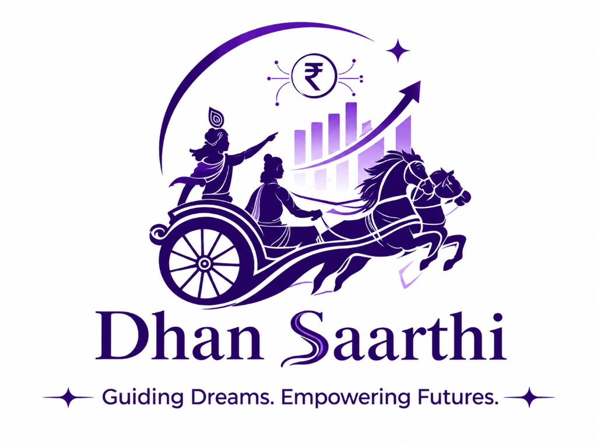
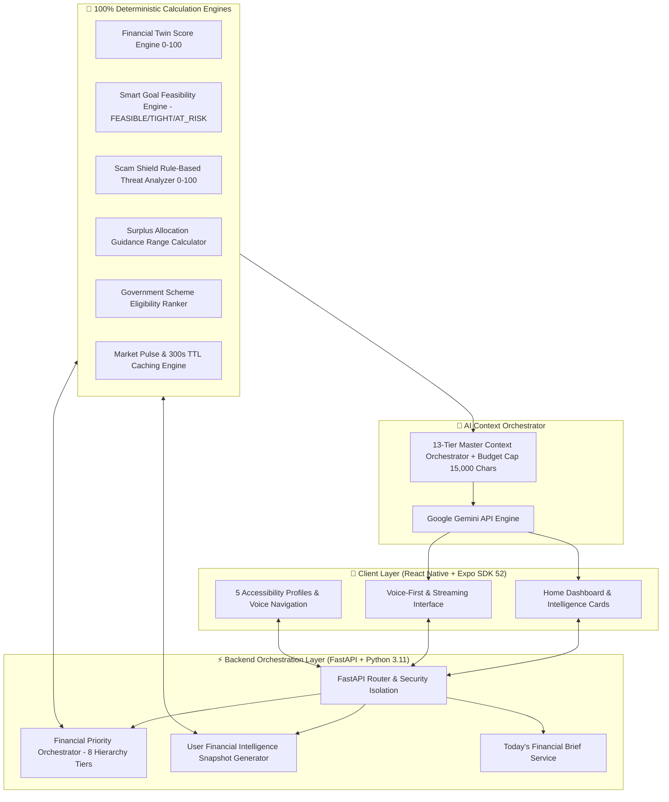

<p align="center">
  
</p>

<h1 align="center">⚡ DHAN SAARTHI (धन सारथी) ⚡</h1>
<h3 align="center">🚀 AI-Powered Personal Financial Companion & Deterministic Financial Twin Engine 🚀</h3>

<p align="center">
  <b><i>Guiding Dreams. Empowering Futures. Built for 1.4 Billion Indians.</i></b>
</p>

<p align="center">
  <a href="#-tech-stack"></a>
  <a href="#-tech-stack"></a>
  <a href="#-tech-stack"></a>
  <a href="#-tech-stack"></a>
  <a href="#-verification"></a>
  <a href="#-accessibility"></a>
</p>

---

## 👤 Author & Project Ownership

**Developed & Maintained by**: **[Ashutosh Singh](https://github.com/ashutoshsingh220)**  
**Repository**: [github.com/ashutoshsingh220/Dhan-Saarthi](https://github.com/ashutoshsingh220/Dhan-Saarthi)  

> 🔒 **Ownership & Copyright Notice**: Copyright © 2026 Ashutosh Singh. All rights reserved. This project, including all architectural designs, algorithms, codebases, and documentation, is owned exclusively by Ashutosh Singh.

---

## 🌟 Executive Overview

**Dhan Saarthi (धन सारथी)** is an enterprise-grade, accessibility-first, AI-driven personal financial companion designed to solve financial fragmentation and exclusion across urban, rural, low-literacy, and visually-impaired demographics in India.

Built around a **Deterministic Financial Twin Engine**, Dhan Saarthi translates raw income, expense, and savings data into an authoritative **Financial Health Score (0–100)**, real-time risk profile, personalized goal planning, fraud protection, government scheme discovery, and live market intelligence — communicated in English, Hindi, and Hinglish via text and high-performance streaming voice.

> 💡 **Core Engineering Rule**: No LLM hallucinates financial calculations. All metrics (Health Scores, Buffer Days, Goal Feasibility, Allocation Ranges, Scam Risk Scores) are computed by **authoritative Python engines**, while **Google Gemini Pro** acts as the empathetic, multi-lingual companion guided by a **13-Tier Master Context Orchestrator**.

---

## 🏗️ SYSTEM ARCHITECTURE & DATA FLOW



---

## 🔥 CORE MODULES IMPLEMENTED & VERIFIED

### 1. 🧬 Financial Twin Dashboard & Health Score (0–100)
- Computes a transparent, deterministic **Financial Health Score (0–100)** based on surplus ratios, liquid savings buffer months, and expense ratios.
- Renders score categories: `Strong Position` ($\ge 80$), `Good Progress` ($60-79$), `Building Foundation` ($40-59$), and `Needs Attention` ($<40$).

### 2. 🤖 AI Saarthi Companion (Gemini Pro + Master Context Orchestrator)
- **13-Tier Bounded Context Hierarchy**: System Safety Rules $\rightarrow$ User Identity $\rightarrow$ Accessibility $\rightarrow$ Personalization $\rightarrow$ Financial Twin $\rightarrow$ Top Priority $\rightarrow$ Goals $\rightarrow$ Recommendations $\rightarrow$ Schemes $\rightarrow$ Market $\rightarrow$ Literacy $\rightarrow$ Scam $\rightarrow$ Response Style.
- **15,000-Character Context Budget Cap**: Automatic graceful context trimming that preserves safety, identity, twin, and priority blocks intact.

### 3. 🎯 Smart Financial Goal Planning Engine
- Calculates exact required monthly contributions and classifies plans into `FEASIBLE`, `TIGHT`, or `AT_RISK`.
- Generates quarterly progress milestones, tracks contributions, and auto-recalculates upon financial changes.

### 4. 🛡️ Scam Shield Fraud Detection Engine
- Rule-based risk scoring ($0-100$) and risk levels (`LOW`, `MODERATE`, `HIGH`, `CRITICAL`).
- Flagged indicator extraction (phishing URLs, urgency keywords, UPI impersonation) with actionable safety advice and scan history.

### 5. 🌾 Government Scheme Discovery Engine
- Curated catalog of 10 verified schemes: PM-KISAN, PMFBY, KCC, AIF, PMMY Mudra, PMEGP, Stand-Up India, PMFME, PMMSY, NLM.
- Evaluates state, district, urban/rural classification, farming activities, and business sectors for deterministic eligibility matching.

### 6. 📈 Live Market Intelligence & Market Pulse Engine
- Integrated **Alpha Vantage Free API** tracking NIFTY 50, SENSEX, GOLD (24K), SILVER, and USD/INR.
- **300s TTL Caching** with rate-limit safeguards, freshness state indicators (`LIVE`, `CACHED`, `STALE`, `UNAVAILABLE`), and deterministic Market Pulse evaluation (`POSITIVE`, `NEGATIVE`, `MIXED`, `CALM`).

### 7. 🧭 Personalized Recommendation & Portfolio Guidance Engine
- Classifies liquid emergency buffer coverage into `CRITICAL_BUFFER`, `LOW_BUFFER`, `MODERATE_BUFFER`, `STRONG_BUFFER`.
- Generates surplus allocation guidance **RANGES** with flexible reserve capacity disclosure.

### 8. 🎙️ High-Performance Voice-First Experience
- **SSE Streaming Endpoint (`POST /api/saarthi/chat/stream`)** for real-time text-to-speech feedback.
- Speech recognition integration, transcript-first entity safety verification, barge-in speech interruption, and rate control.

### 9. ♿ Accessibility-First Engine (WCAG Compliant)
- **5 Tailored Interaction Profiles**: `VISUAL_ASSIST`, `LOW_LITERACY`, `ELDERLY_FRIENDLY`, `VOICE_ASSIST`, `STANDARD`.
- 56px touch targets (`AccessibleQuickActions.tsx`), 1-tap mode banner (`AccessibilityModeBanner.tsx`), step-by-step navigator (`SequentialNavigator.tsx`), high-contrast modes, text scaling ($0.85\times$ to $1.5\times$), and 10-intent voice navigation.

### 10. ⚡ Unified System Orchestration & Today's Financial Brief
- **8-Level Priority Hierarchy**: Ranks scam risks, emergency buffer gaps, high-cost debt, goals at risk, government schemes, literacy needs, wealth building, and market awareness.
- **Today's Financial Brief (`GET /api/dashboard/brief`)**: Daily daily briefing tailored to language, explanation depth (`SIMPLE` / `DETAILED`), and accessibility profile.

---

## 🛠️ TECH STACK & ARCHITECTURE

| Component | Technology | Description |
|---|---|---|
| **Mobile Frontend** | React Native (Expo SDK 52) | Cross-platform iOS, Android & Web app |
| **Language** | TypeScript | Strict Mode (`0 errors`) |
| **Routing** | Expo Router | File-based typed routes |
| **Storage** | `expo-secure-store` | Encrypted hardware key-value storage |
| **Voice & Speech** | `expo-speech` | Native Text-To-Speech readout |
| **Backend API** | Python 3.11 & FastAPI | High-performance async REST framework |
| **Database** | PostgreSQL / SQLite | SQLAlchemy 2.0 ORM with isolated test DB |
| **Authentication** | OAuth2 JWT | `python-jose`, `passlib[bcrypt]` with ownership security |
| **AI LLM** | Google Gemini Pro | `google-genai` SDK with Master Context Orchestration |
| **Market Data** | Alpha Vantage API | 300s TTL Caching Provider |
| **Testing** | Pytest | 102 automated unit/integration tests |

---

## 🌐 API CONTRACTS & ENDPOINTS

### 🔐 Authentication & Profile
- `POST /api/auth/register` — Account registration & JWT generation.
- `POST /api/auth/login` — Authentication.
- `GET /api/profile` | `PUT /api/profile` — Profile onboarding & accessibility updates.

### 🧬 Financial Twin & Planning
- `GET /api/financial-twin` | `PUT /api/financial-twin/generate` — Financial Twin score & summary.
- `GET /api/planning/goals` | `POST /api/planning/goals` — Active goal planning & contribution tracking.

### 🤖 AI Saarthi Chat
- `POST /api/saarthi/chat` — Synchronous chat processing.
- `POST /api/saarthi/chat/stream` — SSE Streaming AI response endpoint.

### 🛡️ Scam Shield & 📚 Financial Literacy
- `POST /api/scam-shield/analyze` — Message scam scan & indicator extraction.
- `GET /api/learn/modules` | `POST /api/learn/modules/{id}/quiz` — Literacy catalog & quiz engine.

### 🌾 Schemes, 📈 Market & 🧭 Recommendations
- `GET /api/schemes/recommendations` — Matched government schemes.
- `GET /api/market/overview` — Live market assets & Market Pulse.
- `GET /api/recommendations` — Surplus allocation guidance ranges.

### ⚡ System Orchestration & Health
- `GET /api/dashboard/brief` — Today's Financial Brief.
- `GET /api/dashboard/snapshot` — Unified intelligence snapshot.
- `GET /api/system/health` — System diagnostic report.

---

## 🧪 VERIFICATION & AUTOMATED TESTS

```powershell
# 1. Run Backend Pytest Test Suite (102/102 Pass)
cd backend
.\.venv\Scripts\python.exe -m pytest tests/ -v

# 2. Run Live 17-Step E2E Verification Script
.\.venv\Scripts\python.exe prompt14_live_test.py

# 3. Check Frontend TypeScript Compiler (0 Errors)
cd ..\frontend
npx tsc --noEmit

# 4. Validate Expo SDK 52 Config
npx expo config --json
```

---

## 🚀 QUICK START & LOCAL SETUP

### Backend Setup
```powershell
cd backend
python -m venv .venv
.\.venv\Scripts\Activate.ps1
pip install -r requirements.txt

# Start Backend API Server
python -m uvicorn app.main:app --reload --host 0.0.0.0 --port 8000
```
*API Documentation will be live at `http://localhost:8000/docs`.*

### Frontend Setup
```powershell
cd ..\frontend
npm install

# Start Expo App
npx expo start
```
*Scan QR code via Expo Go App or press `w` to run on Web.*

---

## 📄 License & Ownership

Copyright © 2026 **Ashutosh Singh**. All Rights Reserved.  
Created and developed by **Ashutosh Singh** ([@ashutoshsingh220](https://github.com/ashutoshsingh220)).
