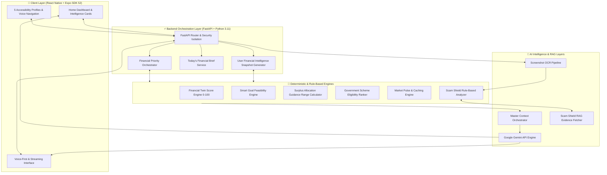

<p align="center">
  
</p>

<h1 align="center"> DHAN SAARTHI (धन सारथी) </h1>
<h3 align="center">🚀 AI-Powered Personal Financial Companion & Deterministic Financial Twin Engine 🚀</h3>

<p align="center">
  <b><i>Guiding Dreams. Empowering Futures. Built for 1.4 Billion Indians.</i></b>
</p>

<p align="center">
  
  
  
  
  
</p>

---

## 🌟 Executive Overview

> **"Financial clarity for everyone. Deterministic intelligence. AI empathy."**

**Dhan Saarthi (धन सारथी)** is an enterprise-grade, accessibility-first, AI-driven personal financial companion designed to solve financial fragmentation and exclusion across urban, rural, low-literacy, and visually-impaired demographics in India.

Built around a **Deterministic Financial Twin Engine**, Dhan Saarthi translates raw income, expense, and savings data into an authoritative **Financial Health Score (0–100)**, real-time risk profile, personalized goal planning, fraud protection, government scheme discovery, and live market intelligence.

Dhan Saarthi features native **Multilingual Support** for the following languages:
1. **English (`en`)**
2. **हिन्दी — Hindi (`hi`)**
3. **Hinglish (`hi-en`)**

> 💡 **Core Engineering Rule**: No AI models hallucinate financial calculations. All metrics (Health Scores, Buffer Days, Goal Feasibility, Allocation Ranges, Scam Risk Scores) are computed by **authoritative Python deterministic engines**, while generative AI acts as the empathetic, multi-lingual companion guided by a **Master Context Orchestrator**.

---

## 🏛️ SYSTEM COMPONENT SEPARATION

To maintain architectural clarity, our codebase enforces a strict separation between deterministic engines and generative AI orchestrators:

| Component | Layer | Verified Implementation in Repository |
| :--- | :--- | :--- |
| **FINANCIAL TWIN ENGINE** | Core Financial Logic | `backend/app/services/twin_service.py`<br>Calculates a transparent Financial Health Score (0-100) using deterministic algorithms, evaluating surplus ratios, liquid savings buffer months, and expense ratios. |
| **SCAM SHIELD (OCR + RAG)** | Security & Fraud Prevention | `backend/app/services/scam_service.py`, `backend/app/api/routes.py`<br>Ingests user screenshots, extracts text via optimized OpenCV + PyTesseract pipelines, and validates against a RAG knowledge base of banking alerts using Gemini vectors. |
| **SCHEME DISCOVERY** | Government Policy Engine | `backend/app/services/scheme_service.py`<br>Rule-based evaluation matching user demographics (urban/rural, farmer, gender) to 10+ verified government schemes (PM-KISAN, PMMY Mudra, etc.). |
| **SAARTHI AI ORCHESTRATOR** | Conversational Intelligence | `backend/app/services/context_builder.py`, `backend/app/providers/gemini_client.py`<br>Orchestrates the LLM context by injecting the user's live Financial Twin state, ensuring the AI companion gives hyper-personalized, mathematically grounded advice. |
| **ACCESSIBILITY LAYER** | Voice & Visual UI | `frontend/context/AccessibilityContext.tsx`, `frontend/services/voice/speechSynthesis.ts`<br>5 distinctive accessibility profiles (`VISUAL_ASSIST`, `LOW_LITERACY`, `ELDERLY`, etc.), dynamic font scaling, and Web Speech API polyfills for voice-first navigation. |
| **LIVE MARKET PULSE** | Market Intelligence | `backend/app/services/market_intelligence_service.py`<br>Fetches live NIFTY 50, SENSEX, and GOLD data with 300s TTL caching and robust fallback mechanisms to prevent rate-limit failures. |

---

## 🏗️ SYSTEM ARCHITECTURE & DATA FLOW



---

## 🔥 CORE CAPABILITIES & FEATURES

### 1. 🧬 Financial Twin & Health Score
Computes a transparent, deterministic **Financial Health Score (0–100)** based on surplus ratios, liquid savings buffer months, and expense ratios. Classifies user portfolios dynamically (`Strong Position`, `Good Progress`, `Building Foundation`, `Needs Attention`).

### 2. 🛡️ Scam Shield (Advanced RAG + OCR Upgrade)
- **Screenshot OCR:** Users can upload images of suspicious messages. The backend uses an optimized OpenCV pipeline (Grayscale, CLAHE Contrast, Denoising, Otsu Thresholding) combined with PyTesseract to extract text safely.
- **RAG Knowledge Base:** Employs Gemini `text-embedding-004` to fetch vectors dynamically against an in-memory knowledge base of verified legitimate Indian banking alerts and known phishing templates.
- **Deterministic Evaluation:** Rule-based heuristics flag urgency, untrusted domains, and UPI requests.

### 3. 📉 Scalable, High-Performance Infrastructure
- **Query Optimization:** Strict SQLAlchemy `joinedload()` implementation prevents N+1 explosive database queries.
- **Pagination & Rate Limiting:** API is secured with IP-based rate limiting (60/min) and offset/limit pagination on heavy data pipelines (like chat history).
- **Frontend Memory Integrity:** Implements `FlatList` component architectures for rendering UI grids, preserving device memory across low-end mobile devices.

### 4. 🌾 Government Scheme Discovery Engine
Curated catalog of 10 verified schemes (PM-KISAN, PMFBY, PMMY Mudra, Stand-Up India, etc.). Evaluates state, district, urban/rural classification, farming activities, and business sectors for deterministic eligibility matching.

### 5. 📈 Live Market Intelligence
Integrated live tracking of NIFTY 50, SENSEX, GOLD, SILVER, and USD/INR. Features robust failovers from Alpha Vantage APIs to public endpoint scraping. Includes a caching layer (300s TTL) with live status badges (`LIVE`, `STALE`) and AI-generated educational insights on daily movements.

### 6. 🎙️ Voice-First Accessibility
Designed for absolute inclusivity. Offers 5 user profiles: `VISUAL_ASSIST`, `LOW_LITERACY`, `ELDERLY_FRIENDLY`, `VOICE_ASSIST`, `STANDARD`. Features text-scaling, large hit targets, sequential speech navigation, and server-sent events (SSE) streaming APIs for real-time auditory chatbot feedback.

### 7. 🔒 Mandatory Data Privacy & Security
The onboarding pipeline mandates an explicit consent and legal privacy agreement before processing user demographics. 

---

## 🛠️ TECH STACK

| Component | Technology | Description |
|---|---|---|
| **Mobile Frontend** | React Native (Expo) | Cross-platform iOS, Android & Web app |
| **Language** | TypeScript | Strict Mode (`0 errors`) |
| **Routing** | Expo Router | File-based typed routes |
| **Backend API** | Python 3.11 & FastAPI | High-performance async REST framework |
| **Database** | PostgreSQL / SQLite | SQLAlchemy 2.0 ORM |
| **Authentication** | OAuth2 JWT | Secure stateless authentication |
| **AI LLM & Embeddings**| Google Gemini Pro | Orchestration & RAG retrieval |
| **Image Processing** | OpenCV + Tesseract | Screenshot text extraction (Scam Shield) |
| **Testing** | Pytest | Full backend unit/integration testing suite |

---

## 🚀 QUICK START & LOCAL SETUP

### Backend Setup
```powershell
cd backend
python -m venv .venv
.\.venv\Scripts\Activate.ps1
pip install -r requirements.txt

# Start Backend API Server
python -m uvicorn app.main:app --reload --host 0.0.0.0 --port 8000
```
*API Documentation will be live at `http://localhost:8000/docs`.*

### Frontend Setup
```powershell
cd ../frontend
npm install

# Start Expo App
npx expo start
```
*Scan QR code via Expo Go App or press `w` to run on Web.*
